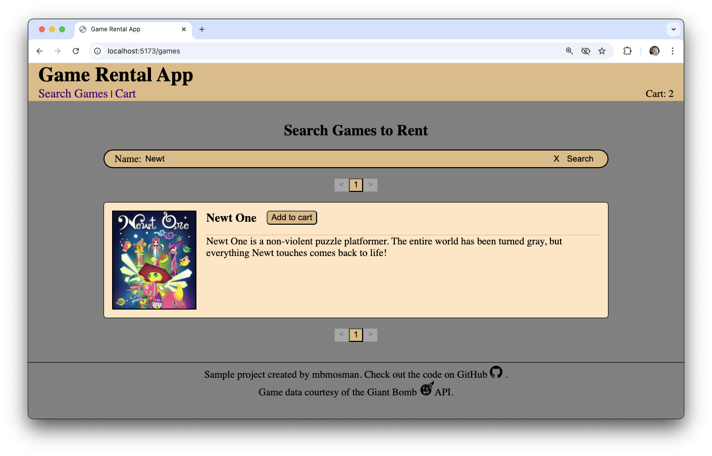
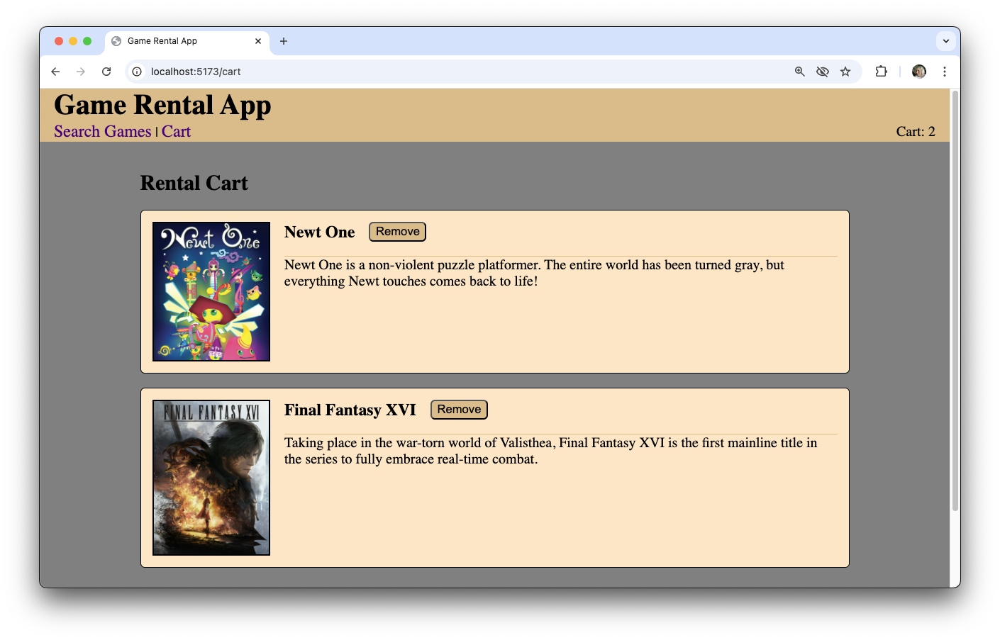

# Game Rental App

## Time Box
3-4 Hours

## Goal
Consume the Giant Bomb API to create an application that allows a user to search and rent games. At a minimum, the application must consist of two unique pages: search and checkout. The views should display at least the game thumbnail and title.

## Stack

- Node.js
- Express
- React

## Local Setup

Download or clone the application. 

You must register for a Giant Bomb API Key to run the application. You can register for one here: https://www.giantbomb.com/api/.

Create a new file named `.env` in the root of the application folder, similar to the `.env.sample` file which you can use as an example. This file must contain your API key.

### Build and run the application

Open the terminal and go to the application folder. Then, run:

```bash
npm install
npm run build
npm start
```

You should see a message similar to the following indicating that the Express server is running:

```text
Server is listening on port 5001...
```

Open the application in the browser by going to http://localhost:5001/.

### Running in development mode

You can also run the project in development mode by running the client and server separately. This saves time if you are making changes as it monitors files for updates without the need to rebuild and rerun the application to see the changes. However, this requires you to use two terminal windows.

In the first, run the server:

```bash
npm run server
```

Then in another terminal, run the client:
```bash
npm run client
```

Open the application in the browser by going to http://localhost:5173/. Note that this is a different port than shown previously.

## Features

The main page of the application allows you to search for games to rent. You can choose to add games to your rental cart from the search results.



Click the "Cart" link at the top to view the games you've selected or to remove games from your cart.



## What might I do next?

There's a lot more that could be done, but this accomplishes my immediate goal. Woot!

With more time I'd consider the following:

- Continue to making components, like: Card, Game, etc. (small task) 
- Use a better component for pagnation. (small task)
- Host the application live. (small task)
- Give it a better name and improve the styling. (big task) Note: I don't consider my web design skills a strength, so I'd likely solicit help.
- Complete a checkout process with auth. However this would then also require more thought and effort to host. (big task)
